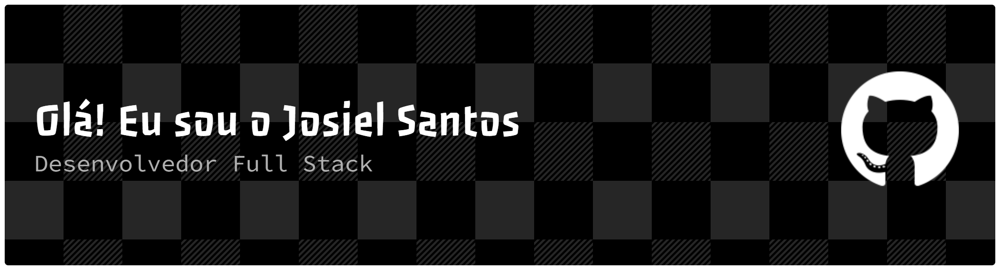

  

  

  

<!-- ===================== ABOUT ===================== -->

<h2 align="center">💻 Sobre mim</h2>

<table align="center">
  <tr>
    <td width="65%" valign="middle">

### Olá, sou Josiel Santos 👨‍💻

Sou um **Desenvolvedor Full-Stack** apaixonado, com 3 anos de experiência, focado em construir experiências digitais modernas, escaláveis e com propósito — do banco de dados à interface.

- 🔭 Atualmente trabalhando em **projetos freelance de desenvolvimento web full-stack**
- 🌱 Atualmente aprendendo **TypeScript e Next.js**
- 💡 Interessado em **React, React Native e arquitetura limpa**
- 👯 Aberto a colaborar em **projetos open source e aplicações React/Node.js**
- 💬 Me pergunte sobre **React, React Native, Node.js e desenvolvimento full-stack**
- ⚡ Curiosidade: **Sou de Oriximiná, no interior do Pará** 🌳

 

> *"Código não é só sobre resolver problemas — é sobre criar possibilidades."*

  </td>

  <td width="35%" align="center" valign="middle">

  </td>
  </tr>
</table>

  

<!-- ===================== TECH STACK ===================== -->

<h2 align="center">🛠️ Tecnologias</h2>

  

  

  

  

<!-- ===================== GITHUB STATS ===================== -->

<h2 align="center">📊 Estatísticas do GitHub</h2>

 

  

<!-- ===================== CONTRIBUTION SNAKE ===================== -->

<h2 align="center">🐍 Cobrinha de Contribuições</h2>

<!--
  Para essa animação funcionar, crie o arquivo abaixo no seu repositório
  JosielSantos16/JosielSantos16 em: .github/workflows/snake.yml

  name: Generate Snake

  on:
    schedule:
      - cron: "0 */12 * * *"
    workflow_dispatch:
    push:
      branches:
        - main

  jobs:
    generate:
      permissions:
        contents: write

      runs-on: ubuntu-latest

      steps:
        - uses: Platane/snk/svg-only@v3
          with:
            github_user_name: JosielSantos16
            outputs: |
              dist/github-contribution-grid-snake.svg
              dist/github-contribution-grid-snake-dark.svg?palette=github-dark

        - uses: crazy-max/ghaction-github-pages@v4
          with:
            target_branch: output
            build_dir: dist
          env:
            GITHUB_TOKEN: ${{ secrets.GITHUB_TOKEN }}
-->

  

  

<!-- ===================== CONNECT ===================== -->

<h2 align="center">🤝 Vamos nos conectar</h2>

  

  

  

  

<!-- ===================== FOOTER ===================== -->

  <i>✨ Obrigado pela visita — vamos construir algo incrível juntos.</i>

  

